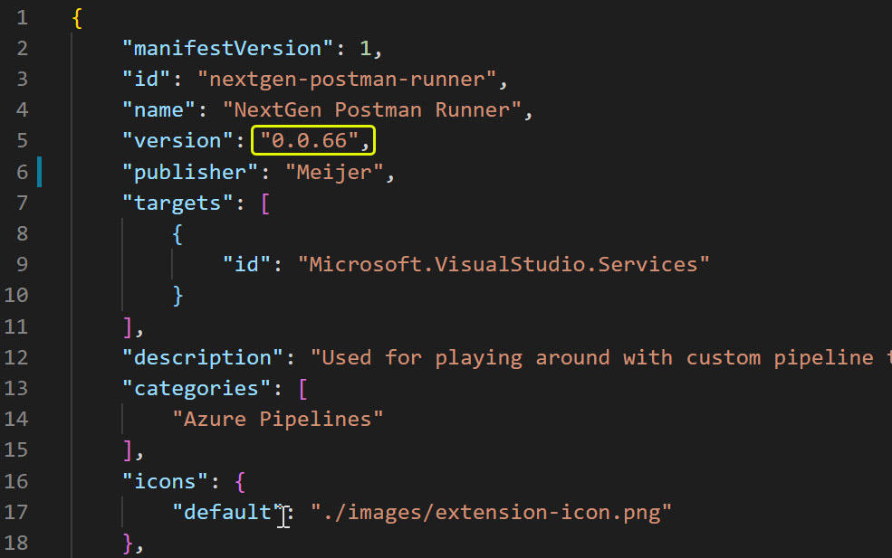
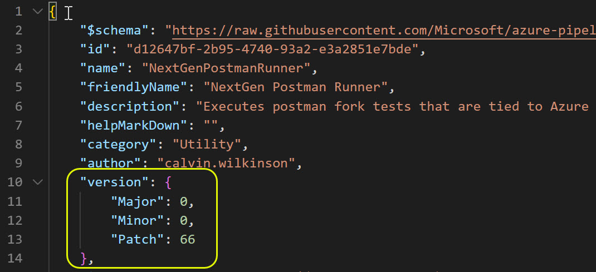

</img>

<span style="font-weight: bold;font-size:20pt;display: block;margin-left: auto;margin-right: auto;width:50%">ADD-TITLE-HERE</span>

---

## <span style="color:mediumseagreen;font-weight:bold">Development Environment Setup</span>

1. Install [NodeJS](https://nodejs.org/en/download/).
   * NOTE: If **Carbon Black** blocks the installation and/or running of **NodeJS**, you will have to get them approved to run on your machine.
   * Purpose: This is required for dealing with anything npm package related.
2. Install [Yarn](https://yarnpkg.com/).  You can install yarn globally using npm itself using the npm command `npm install -g yarn`.
   * NOTE: This might get blocked by **Carbon Black**
   * Purpose: This is used for NPM package management and project scripts

## <span style="color:mediumseagreen;font-weight:bold">Project Scripts</span>

The `package.json` has various scripts that are used to simplify development tasks such as building manually and automatically with code changes, cleaning and packaging.  These scripts can be ran with yarn commands in the directory that contains the `package.json` file.  Postfix `yarn` command with any script name in the `package.json` file to run that script.

1. **Building**
   * **Description:** This **building** of the project simply prepares the `.env` environment file and uses the typescript compiler to generate all of the javascript for the task.
      ```bash
      yarn build
      ```
2. **Automatic Building**
   * **Description:** You can automatically build as you save code changes by putting the compiler into watch mode. This simply tells the compiler to watch for file changes and recompile when changes have been detected.
     * **NOTE:** To automatically build as you type, you must have **Visual Studio Code** set to automatically save files.  To turn this on, goto `File > Auto Save`
      ```bash
      yarn build-watch
      ```
3. **Task Packaging**
   * **Description:** Running this script creates a **VSIX** package.
     * **NOTE:** Before packaging, make sure that automatic building is turned off.  This is to ensure that strange things will not occur during packaging.  The packaging process will trigger changes and can cause issues.
      ```bash
      yarn package-task
      ```
4. **Project cleaning**
   * **Description:** Sometimes you might want to clean the project, similar to **Visual Studio** and cleaning the solution.  This "cleans" the project by deleting the `bin` and `node_modules` folders from disk.
      ```bash
      yarn clean
      ```
5. **Rebuilding**
   * **Description:** This is simply the combination of cleaning the project and then building the project afterwards.
      ```bash
      yarn rebuild
      ```

## <span style="color:mediumseagreen;font-weight:bold">Debugging</span>

1. To debug, simply run the project by hitting the `F5` key.  Set a breakpoint on any typescript line of code and **Visual Studio Code** will break at that line of code.
2. To debug different task input values, open the `.env` file and change the value for the appropriate task input name.  These are simply key value pairs.
   * **NOTE:** Make sure to `yarn build` or `yarn rebuild` the project when changing the contents of the `.env` file.

## <span style="color:mediumseagreen;font-weight:bold">Environment File Info</span>

This explains how the `.env` files works and its purpose.

1. The environment file is copied to the `./buildAndReleaseTask/bin/` directory.  This folder is the build output folder.
2. When doing standard building, the contents of the `.env` file will have the `NODE_ENV` variable set to `DEBUG`.
3. When packaging occurs, the entire contents of `./buildAndReleaseTask/bin/.env` will be replaced with a single key value pair indicating that the task is running in production mode.  This value will be `NODE_ENV=PRODUCTION`.  The other key value pairs which are the task inputs and values are stripped from the file and are only used for debugging and testing locally.
4. The management of how the task inputs are loaded during **debug** mode vs **production** mode are handled in the `TaskInputs` class.

## <span style="color:mediumseagreen;font-weight:bold">Updating Task Version</span>

The version of the task can be updated by making changes to the `vss-extension.json` and `task.json` files.  These files are manifest files and are required by the custom pipeline task system.  When updating the version, update the version in both files to the same version.  Semantic versioning should be used.

1. Change the major, minor and patch version numbers in `vss-extension.json` file appropriately
   * 
2. Change the major, minor and patch version numbers in `task.json` file appropriately
   * 

## <span style="color:mediumseagreen;font-weight:bold">References</span>

1. [NodeJS](https://nodejs.org/en/)
2. [TypeScript](https://www.typescriptlang.org/)
3. [Yarn](https://yarnpkg.com/)
4. [npm](https://www.npmjs.com/)
5. ESLint
   * [Using ESLint & Prettier](https://www.robertcooper.me/using-eslint-and-prettier-in-a-typescript-project)
   * [ESLint](https://eslint.org/)
6. Custom Pipeline Tasks
   * [Node CLI for Azure DevOps](https://www.npmjs.com/package/tfx-cli)
   * [Publishing From Command Line](https://docs.microsoft.com/en-us/azure/devops/extend/publish/command-line?view=azure-devops)
   * [Create Custom Pipeline task](https://docs.microsoft.com/en-us/azure/devops/extend/develop/add-build-task?view=azure-devops)
   * [Package & Publish Extensions](https://docs.microsoft.com/en-us/azure/devops/extend/publish/overview?view=azure-devops)
   * [Integrating custom build tasks into extensions](https://docs.microsoft.com/en-us/azure/devops/extend/develop/integrate-build-task?view=azure-devops)
